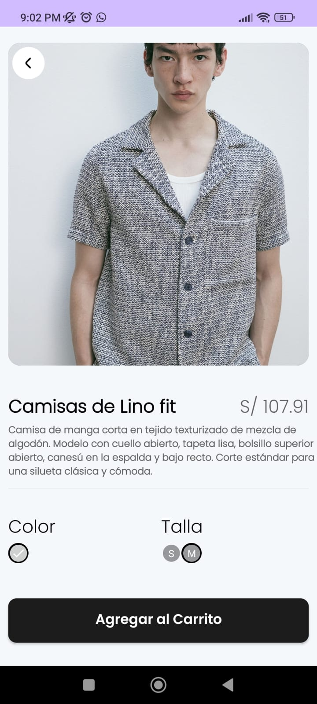
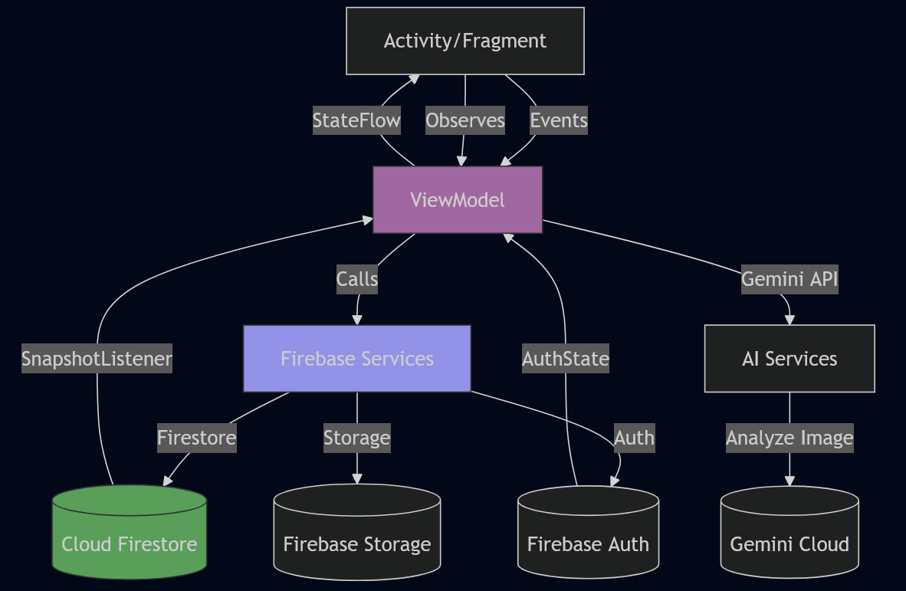

# 🛍️ Elegant Commerce

**Modern E-Commerce Android App**

A feature-rich shopping platform with AI integration, real-time sync, and robust architecture.

## Table of Contents

- [🛍️ Elegant Commerce](#️-elegant-commerce)
  - [Table of Contents](#table-of-contents)
  - [App Preview](#app-preview)
  - [Key Features](#key-features)
    - [🚀 Core Shopping Experience](#-core-shopping-experience)
    - [🔐 Authentication \& Profile](#-authentication--profile)
    - [🔄 Real-Time Capabilities](#-real-time-capabilities)
  - [Tech Stack](#tech-stack)
  - [Architecture Overview](#architecture-overview)
  - [Firebase Integration](#firebase-integration)
  - [Getting Started](#getting-started)
    - [Prerequisites](#prerequisites)
    - [Installation](#installation)
  - [Contribution Guidelines](#contribution-guidelines)

## App Preview

| Home Screen                              | Product Details                                | Cart                                     | AI Style Assistant                   | Profile                                        |
| ---------------------------------------- | ---------------------------------------------- | ---------------------------------------- | ------------------------------------ | ---------------------------------------------- |
|  |  |  |  |  |

## Key Features

### 🚀 Core Shopping Experience

- **Smart Cart System**: Real-time synchronization, quantity management, color/size selection.
- **AI-Powered Style Assistant**: Image analysis & style recommendations with Gemini integration; TTS responses.
- **Multi-Category Browsing**: Browse Popular, Offers, Best Products with pagination.
- **Atomic Order Management**: Reliable order placement using Firestore transactions.

### 🔐 Authentication & Profile

- Secure email/password authentication.
- Password recovery flow.
- Profile management with image uploads.
- Session persistence via Firebase Auth.

### 🔄 Real-Time Capabilities

- Live price and offer updates.
- Address book synchronization.
- Order history tracking.
- Inventory management.

## Tech Stack

| Category                 | Technologies                    |
| ------------------------ | ------------------------------- |
| **Language**             | Kotlin                          |
| **Architecture**         | MVVM, Clean Architecture        |
| **Dependency Injection** | Hilt                            |
| **Asynchronous**         | Coroutines, Flow, StateFlow     |
| **Database**             | Firebase Firestore              |
| **Storage**              | Firebase Storage                |
| **Analytics**            | Firebase Analytics, Crashlytics |
| **Image Loading**        | Glide                           |
| **AI Integration**       | Google Gemini API               |
| **TTS**                  | Android Text-to-Speech          |

**Android Jetpack Components**:

- Navigation Component
- ViewModel + LiveData
- Data Binding
- (Optional) Room for local caching

## Architecture Overview



**Key ViewModels**:

- `CartViewModel`: Manages cart operations with Firestore transactions.
- `OrderViewModel`: Handles atomic order placements.
- `ChatViewModel`: Powers AI style recommendations.
- `ProfileViewModel`: Manages user data and image uploads.

## Firebase Integration

**Firestore Collections Structure**:

```
user/{uid}/
  ├── cart/          // Active cart items
  ├── orders/        // Order history
  ├── address/       // Saved addresses
  └── profile/       // User metadata

products/
  ├── offers/
  └── popular/

orders/              // Global order tracking
```

**Security Rules**:

```javascript
rules_version = '2';
service cloud.firestore {
  match /databases/{database}/documents {
    match /user/{userId}/{document=**} {
      allow read, write: if request.auth != null && request.auth.uid == userId;
    }
  }
}
```

## Getting Started

### Prerequisites

- Android Studio Hedgehog or newer.
- Firebase project with Firestore, Auth, Storage, and Analytics enabled.
- Google Gemini API key.

### Installation

```bash
git clone https://github.com/yourusername/elegant-commerce.git
cd elegant-commerce
```

1. Add `google-services.json` into the `/app` directory.
2. Create `gemini-key.properties` with your Gemini API key.

## Contribution Guidelines

1. Fork the repository.
2. Create a feature branch: `git checkout -b feature/your-feature`.
3. Commit changes: `git commit -m "Add amazing feature"`.
4. Push to branch: `git push origin feature/your-feature`.
5. Open a pull request.

**Quality Standards**:

- 100% Kotlin codebase
- Testable architecture (ViewModel + DI)
- Compliant with key MAD principles:  
  • Reactive UI with StateFlow  
  • Dependency Injection via Hilt  
  • Modular architecture
